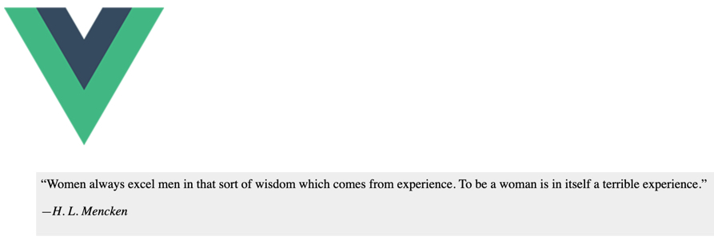

# vue-inspirational-quote

This is a tiny component that uses the https://favqs.com API to retrieve random inspirational quotes. In the example below we only use 'body' and 'author', but there are more to explore on [https://favqs.com]. 

There is no dependency and the component will pass the entire quote data throughout scoped slots.

Therefore, you must use a scoped template. And that is the beauty of vue because you can display data however you want to style it.

Check examples here under.



in order to install it in your project
```
npm install vue-inspirational-quote (or npm i vue-inspirational-quote)

```

then import the component where you need it

```
<template>
    <div>
        <vue-inspirational-quote>
            <template v-slot:default="slotProps">
            <blockquote class="blockquote quote">
                &#8220;{{ slotProps.quote.body }}&#8221;
                <p>
                    <em>&mdash;{{ slotProps.quote.author }}</em>
                </p>
            </blockquote>
            </template>
        </vue-inspirational-quote> 
    </div>
</template>

<script>
import VueInspirationalQuote from "vue-inspirational-quote"

export default {
    components: {
    VueInspirationalQuote
    },
}

</script>
<style scoped>
    .quote
    {
    background-color:#eee;
    padding:6px;
    }
</style>

```

Events
------

| Name              | Params                       | Info                                                  |
| ----------------- | ---------------------------- | ----------------------------------------------------- |
| **@quote**         | *item*: (the quote data) item.value         | emits the quote              |


This is the demo in the marvelous Codesandbox\
[](https://codesandbox.io/s/vue-inspirational-quote-757s7?fontsize=14&hidenavigation=1&theme=dark)


## Version History
- 0.1.3 First Working Version.